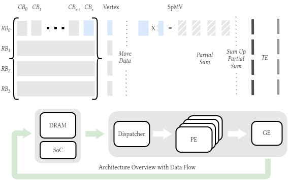

# Quantized simulated bifurcation machine

## Prerequisite

For simulation,
[SpinalHDL installation](https://spinalhdl.github.io/SpinalDoc-RTD/master/SpinalHDL/Getting%20Started/index.html)
[Verilator](https://github.com/verilator/verilator)

For implementation
[Vivado/Vitis](https://www.xilinx.com/support/download.html)

## Introduction

Detailed Introduction from Toshiba 

## Simulation

To run pre simulation, you need to select simulator in TopSim by set simulator to "Verilator" or "Xsim". Please refer to [SpinalHDL Simualtion](https://spinalhdl.github.io/SpinalDoc-RTD/master/SpinalHDL/Simulation/index.html) for trouble shoot.

### Verilator vs Xsim

Verilator use C++ model to perform simulation, which is much more faster than Xsim. Xsim not just takes much longer time on setting up Vivado project but has problem with probing DUT internal signal. Therefore, in Verilator mode, the whole simualtion flow and data comparison is made. In Xsim mode, simulation will only proceed for a short period, then the tcl block design and synthesis flow will be called

## Synthesis & Implementation

## Task-partitioning Driven Architecture Overview with Data Flow 

The proposed architecture for the qSBM is constructed based on task partitioning on simulated bifurcation. 

Since SB can be partitioned into SpMV and TE, we match the parts into actual hardware unit PE and GE respectively. By inserting a ping-pong RAM, PE and GE can work in parallel. To accommodate the ultra large Ising graph. The quantized graph and vector are stored in DRAM. In addition, a data flow processing paradigm is applied. Where the Dispatcher orchestrating edge and vertex data transfers between DRAM and the multiple processing elements (PEs) while setting up the qSB parameters registers.The PEs are designed to process SpMV. Two different PE is designed for SpMV format COO and CSR

### COO based SpMV

### CSR based SpMV

## Result

### qSB Performance

### FPGA implementation Result